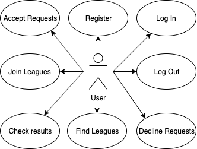
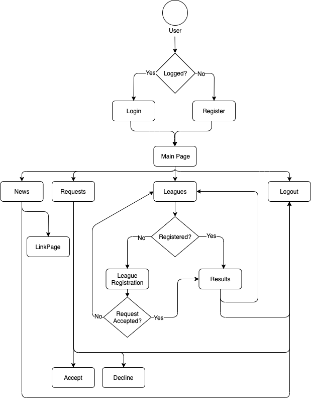
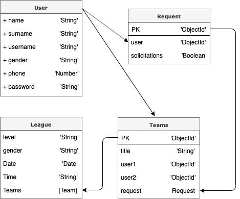

# Time2Padel

Time2Padel is an individual project that I have developed for SkylabCoders bootcamp, as the endpoint of all the course we did. 

It has been designed as a mobile first Application that provides information about the leagues you can find in a padel club. 
You must be registered to see the content of the page, once you do that you can find many information and the list of leagues the club has available on that moment, filtered by level, gender and timming. 

User will be able to register in many leagues with another user. For each registration a request will be send to the other user in order that they can accept or decline the request.

## Features

    - Login & Register User
    - Navigate throw the website, click on the links and chage to the different views.
    - Check list of leagues and possibility to register to them. Registration + send request to another user from the database.
    - Possibility to confirm or cancel the request.
    - Add players to the league or decline the request and delete the registration process.

## Functional Description

At Time2Padel, user will see an Application with information related to the club and the leagues they have available on that moment.

User can also join every league they want if it matches with the gender. More detailed info below:
    - Fem Leagues: Need two Fem profiles to succeed.
    - Masc Leagues: Need two Masc profiles to succeed.
    - Mix Leagues: Need one Fem and one Masc profile to succeed.

Users information will be stored in a data base where we will later call them to recover the information required to join the different leagues. This process will involve two users:
    1) Will make the registration using username and password and will add the username of the user who wants play with.
    2) The other user will receive a request and will have the possiblity to accept it or decline it. 

The process will have 2 endpoints:
    - If the request is accepted, both players will be added to the selected league.
    - If the request is declined, the registration process will be deleted.

### Use cases

User ca Log-In, Log-Out, Register, Find Leagues, Join a League, Accept Requests, Decline Requests and Check the results. 

## Flow

## Technical Description

### Components

List of the components used in the project:

    - Header
    - Footer
    - Landing
    - Registration-page
    - Main
    - Requests
    - Leagues
    - League-registration
    - Results
    
### Blocks
### Data Model 

