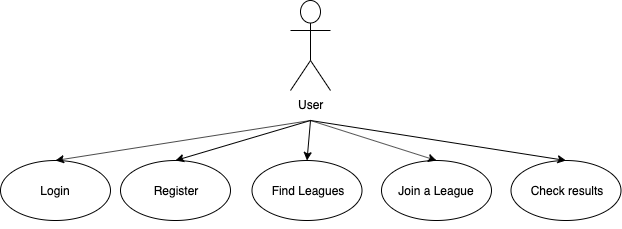

# Time2Padel

## Description

Time2Padel is an individual project that I have developed for SkylabCoders bootcamp, as the endpoint of all the course we did. 

It has been designed as a mobile first Application that provides information about the leagues you can find in a padel club. 
You must be registered to see the content of the page, once you do that you can find many information and the list of leagues the club has available on that moment, filtered by level, gender and timming. 

Users information will be stored in a data base where we will later call them to recover the information required to join the different leagues. 

## Functional Description

At Time2Padel, user will see an Application with information related to the club and the leagues they have available on that moment.

User can also join every league they want if it matches with the gender. More detailed info below:
- Fem Leagues: Need two Fem profiles to succeed.
- Masc Leagues: Need two Masc profiles to succeed.
- Mix Leagues: Need one Fem and one Masc profile to succeed.

In addition, user can create a personal account and send messages to other registered profiles to propose playing together in the different leagues, the other person will receive in their personal account a notification with the proposal.

### Use cases

User ca Log-In, Log-Out, Register, Find Leagues, Join a League, and check the results. 

## Technical Description

### Components
### Blocks
### Data Model 

